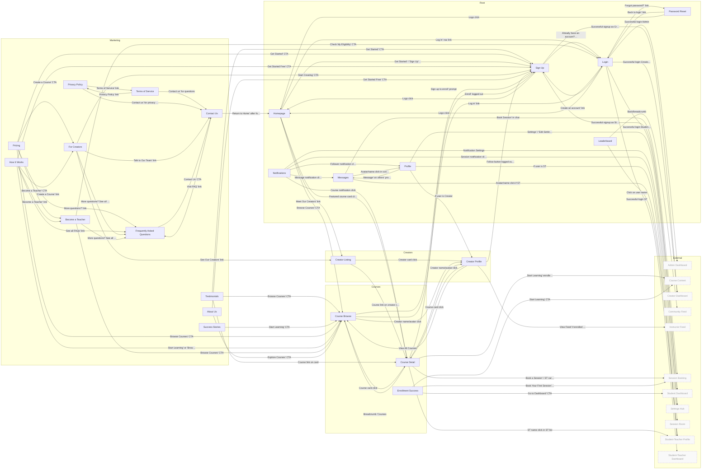
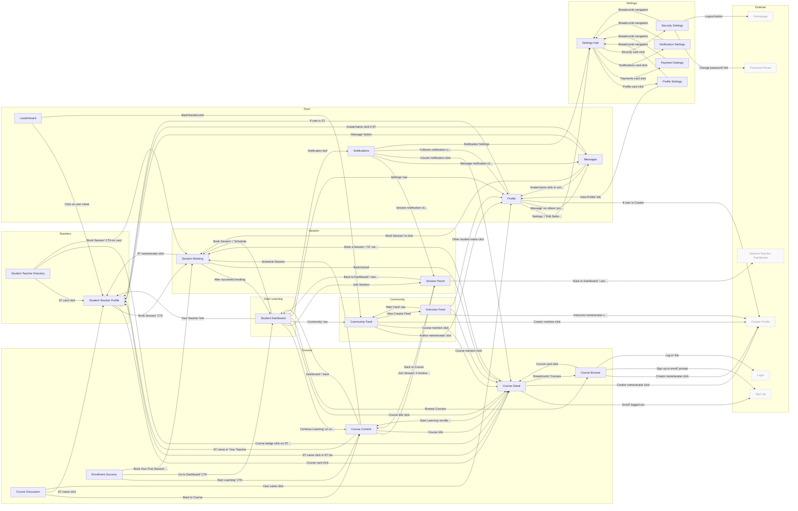
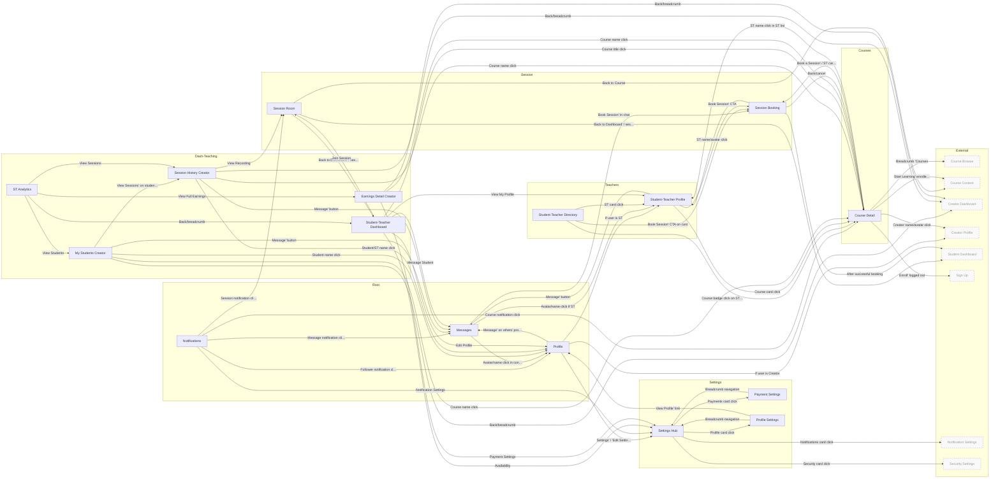
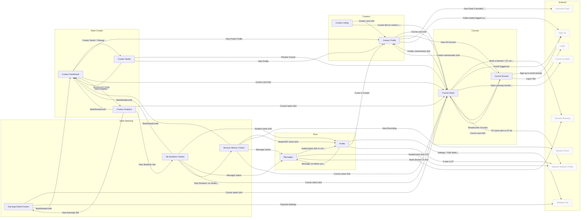
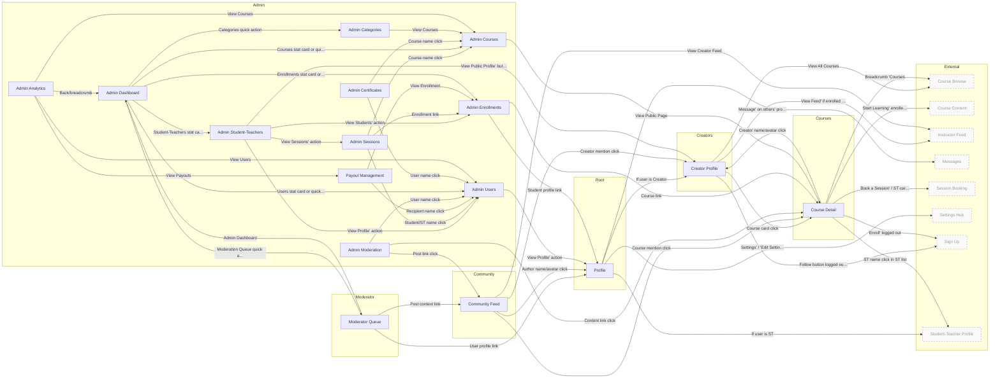

# Site Map

Page interconnection diagrams. Originally auto-generated from page JSON specs (now archived).
The generation script was removed in Session 307 (2026-02-27). This file is now a static reference.

Last Generated: 2026-01-28

**60** pages, **202** connections across all focuses

| Focus | Primary Pages | Description |
|-------|:------------:|-------------|
| [Public / Visitor Journey](#public) | 24 | Marketing pages, course/creator browsing, auth flow |
| [Student Journey](#student) | 21 | Dashboard, learning, sessions, community, settings |
| [Student-Teacher Journey](#teacher) | 16 | Teaching dashboard, students, sessions, earnings, analytics |
| [Creator Journey](#creator) | 12 | Creator dashboard, studio, analytics, profile |
| [Admin Journey](#admin) | 16 | Admin dashboard, management pages, moderation |

---

## Public / Visitor Journey {#public}

Marketing pages, course/creator browsing, auth flow

**24** primary pages, **11** boundary, **81** connections

### Public / Visitor Journey — Connections

| Page | Out | Targets |
|------|:---:|---------|
| ABOU | 2 | SGUP, CBRO |
| BTAT | 3 | CBRO, LGIN, FAQP |
| CBRO | 4 | CDET, CPRO, SGUP, LGIN |
| CDET | 6 | *SBOK*, SGUP, *CCNT*, CPRO, *STPR*, CBRO |
| CONT | 2 | FAQP, HOME |
| CPRO | 4 | CDET, CBRO, *IFED*, SGUP |
| CRLS | 2 | CPRO, CDET |
| CSUC | 3 | *CCNT*, *SDSH*, *SBOK* |
| FAQP | 1 | CONT |
| FCRE | 4 | SGUP, CRLS, CONT, FAQP |
| HOME | 5 | CBRO, CDET, CRLS, SGUP, LGIN |
| HOWI | 5 | SGUP, CBRO, BTAT, FCRE, FAQP |
| LEAD | 2 | *STPR*, *FEED* |
| LGIN | 7 | *SDSH*, *TDSH*, *CDSH*, *ADMN*, SGUP, PWRS, HOME |
| MSGS | 3 | PROF, *STPR*, *SBOK* |
| NOTF | 5 | *SROM*, MSGS, CDET, PROF, *SETT* |
| PRIC | 5 | CBRO, SGUP, BTAT, FCRE, FAQP |
| PRIV | 2 | TERM, CONT |
| PROF | 4 | *SETT*, MSGS, CPRO, *STPR* |
| PWRS | 2 | LGIN, HOME |
| SGUP | 4 | *SDSH*, *CDSH*, LGIN, HOME |
| STOR | 1 | CBRO |
| TERM | 2 | PRIV, CONT |
| TSTM | 3 | CBRO, SGUP, CDET |

*Italicized* targets are boundary pages (outside this focus area).

---

## Student Journey {#student}

Dashboard, learning, sessions, community, settings

**21** primary pages, **6** boundary, **75** connections

### Student Journey — Connections

| Page | Out | Targets |
|------|:---:|---------|
| CBRO | 4 | CDET, *CPRO*, *SGUP*, *LGIN* |
| CCNT | 5 | SBOK, SROM, SDSH, CDET, STPR |
| CDET | 6 | SBOK, *SGUP*, CCNT, *CPRO*, STPR, CBRO |
| CDIS | 3 | CCNT, STPR, PROF |
| CSUC | 3 | CCNT, SDSH, SBOK |
| FEED | 4 | PROF, CDET, *CPRO*, IFED |
| IFED | 4 | *CPRO*, CDET, PROF, FEED |
| LEAD | 2 | STPR, FEED |
| MSGS | 3 | PROF, STPR, SBOK |
| NOTF | 5 | SROM, MSGS, CDET, PROF, SETT |
| PROF | 4 | SETT, MSGS, *CPRO*, STPR |
| SBOK | 3 | SDSH, STPR, CDET |
| SDSH | 9 | CCNT, SBOK, SROM, CDET, FEED, CBRO, PROF, STPR, NOTF |
| SETT | 4 | SPRF, SPAY, SNOT, SSEC |
| SNOT | 1 | SETT |
| SPAY | 1 | SETT |
| SPRF | 2 | SETT, PROF |
| SROM | 3 | SDSH, *TDSH*, CCNT |
| SSEC | 3 | SETT, *PWRS*, *HOME* |
| STDR | 3 | STPR, CDET, SBOK |
| STPR | 3 | SBOK, CDET, MSGS |

*Italicized* targets are boundary pages (outside this focus area).

---

## Student-Teacher Journey {#teacher}

Teaching dashboard, students, sessions, earnings, analytics

**16** primary pages, **8** boundary, **60** connections

### Student-Teacher Journey — Connections

| Page | Out | Targets |
|------|:---:|---------|
| CDET | 6 | SBOK, *SGUP*, *CCNT*, *CPRO*, STPR, *CBRO* |
| CEAR | 3 | CDET, SETT, *CDSH* |
| CMST | 5 | PROF, MSGS, CDET, CSES, *CDSH* |
| CSES | 5 | PROF, SROM, MSGS, CDET, *CDSH* |
| MSGS | 3 | PROF, STPR, SBOK |
| NOTF | 5 | SROM, MSGS, CDET, PROF, SETT |
| PROF | 4 | SETT, MSGS, *CPRO*, STPR |
| SBOK | 3 | *SDSH*, STPR, CDET |
| SETT | 4 | SPRF, SPAY, *SNOT*, *SSEC* |
| SPAY | 1 | SETT |
| SPRF | 2 | SETT, PROF |
| SROM | 3 | *SDSH*, TDSH, *CCNT* |
| STDR | 3 | STPR, CDET, SBOK |
| STPR | 3 | SBOK, CDET, MSGS |
| TANA | 4 | CEAR, CSES, CMST, TDSH |
| TDSH | 6 | SROM, STPR, PROF, SETT, MSGS, CDET |

*Italicized* targets are boundary pages (outside this focus area).

---

## Creator Journey {#creator}

Creator dashboard, studio, analytics, profile

**12** primary pages, **8** boundary, **47** connections

### Creator Journey — Connections

| Page | Out | Targets |
|------|:---:|---------|
| CANA | 4 | CDET, CMST, CEAR, CDSH |
| CBRO | 4 | CDET, CPRO, *SGUP*, *LGIN* |
| CDET | 6 | *SBOK*, *SGUP*, *CCNT*, CPRO, *STPR*, CBRO |
| CDSH | 4 | STUD, CPRO, CDET, CANA |
| CEAR | 3 | CDET, *SETT*, CDSH |
| CMST | 5 | PROF, MSGS, CDET, CSES, CDSH |
| CPRO | 4 | CDET, CBRO, *IFED*, *SGUP* |
| CRLS | 2 | CPRO, CDET |
| CSES | 5 | PROF, *SROM*, MSGS, CDET, CDSH |
| MSGS | 3 | PROF, *STPR*, *SBOK* |
| PROF | 4 | *SETT*, MSGS, CPRO, *STPR* |
| STUD | 3 | CDSH, CDET, CPRO |

*Italicized* targets are boundary pages (outside this focus area).

---

## Admin Journey {#admin}

Admin dashboard, management pages, moderation

**16** primary pages, **8** boundary, **50** connections

### Admin Journey — Connections

| Page | Out | Targets |
|------|:---:|---------|
| AANA | 4 | ADMN, AUSR, ACRS, APAY |
| ACAT | 1 | ACRS |
| ACRS | 1 | CDET |
| ACRT | 2 | AUSR, ACRS |
| ADMN | 6 | AUSR, ACRS, AENR, ASTC, ACAT, MODQ |
| AENR | 2 | PROF, CDET |
| AMOD | 3 | AUSR, CDET, FEED |
| APAY | 2 | AUSR, AENR |
| ASES | 3 | AUSR, ACRS, AENR |
| ASTC | 4 | AUSR, AENR, ASES, CPRO |
| AUSR | 1 | PROF |
| CDET | 6 | *SBOK*, *SGUP*, *CCNT*, CPRO, *STPR*, *CBRO* |
| CPRO | 4 | CDET, *CBRO*, *IFED*, *SGUP* |
| FEED | 4 | PROF, CDET, CPRO, *IFED* |
| MODQ | 3 | FEED, PROF, ADMN |
| PROF | 4 | *SETT*, *MSGS*, CPRO, *STPR* |

*Italicized* targets are boundary pages (outside this focus area).

---
