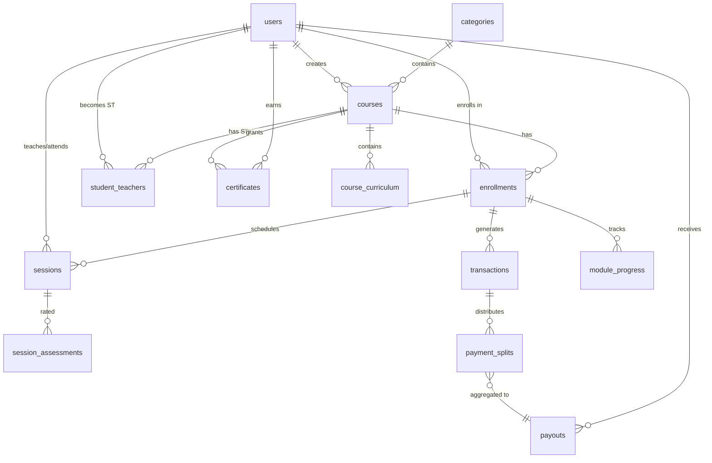

# Database Schema Relationships

*Last Updated: 2026-01-31*

Simplified entity relationship diagram showing table connections only (no fields).

## Full Schema (48 tables)

```mermaid
erDiagram
    %% Core Entities
    users ||--o{ user_qualifications : has
    users ||--o{ user_expertise : has
    users ||--o| user_stats : has
    users ||--o{ user_interests : has
    users ||--o| user_availability : has
    users ||--o{ availability : sets

    %% Courses
    categories ||--o{ courses : contains
    users ||--o{ courses : creates
    courses ||--o{ course_tags : has
    courses ||--o{ course_objectives : has
    courses ||--o{ course_includes : has
    courses ||--o{ course_prerequisites : has
    courses ||--o{ course_target_audience : has
    courses ||--o{ course_testimonials : has
    courses ||--o{ course_curriculum : has
    courses ||--o| peerloop_features : has

    %% Resources & Homework
    courses ||--o{ session_resources : has
    course_curriculum ||--o{ session_resources : contains
    users ||--o{ session_resources : uploads
    courses ||--o{ homework_assignments : has
    course_curriculum ||--o{ homework_assignments : contains
    users ||--o{ homework_assignments : creates
    homework_assignments ||--o{ homework_submissions : receives
    users ||--o{ homework_submissions : submits
    enrollments ||--o{ homework_submissions : linked

    %% Enrollments & Progress
    users ||--o{ enrollments : enrolls
    courses ||--o{ enrollments : has
    users ||--o{ enrollments : teaches
    enrollments ||--o{ module_progress : tracks
    course_curriculum ||--o{ module_progress : tracked

    %% Student Teachers & Certificates
    users ||--o{ student_teachers : becomes
    courses ||--o{ student_teachers : has
    users ||--o{ student_teachers : approves
    users ||--o{ certificates : earns
    courses ||--o{ certificates : grants
    users ||--o{ certificates : issues
    users ||--o{ certificates : recommends

    %% Sessions
    enrollments ||--o{ sessions : has
    users ||--o{ sessions : teaches
    users ||--o{ sessions : attends
    sessions ||--o{ session_assessments : has
    users ||--o{ session_assessments : gives
    users ||--o{ session_assessments : receives
    sessions ||--o{ session_attendance : tracks
    users ||--o{ session_attendance : joins
    users ||--o{ intro_sessions : hosts
    courses ||--o{ intro_sessions : promotes

    %% Payments
    enrollments ||--o{ transactions : generates
    transactions ||--o{ payment_splits : splits
    enrollments ||--o{ payment_splits : linked
    users ||--o{ payment_splits : receives
    users ||--o{ payouts : receives
    payouts ||--o{ payment_splits : aggregates
    users ||--o{ session_credits : earns
    sessions ||--o{ session_credits : sources

    %% Social
    users ||--o{ follows : follows
    users ||--o{ follows : followed
    users ||--o{ course_follows : follows
    courses ||--o{ course_follows : followed

    %% Messaging
    conversations ||--o{ conversation_participants : has
    users ||--o{ conversation_participants : joins
    conversations ||--o{ messages : contains
    users ||--o{ messages : sends
    users ||--o{ notifications : receives

    %% Moderation
    users ||--o{ content_flags : flags
    users ||--o{ content_flags : flagged
    content_flags ||--o{ moderation_actions : triggers
    users ||--o{ moderation_actions : performs
    users ||--o{ user_warnings : receives
    content_flags ||--o{ user_warnings : causes
    moderation_actions ||--o{ user_warnings : results
    users ||--o{ moderator_invites : invites

    %% Marketing (standalone)
    users ||--o{ success_stories : featured
    courses ||--o{ success_stories : featured
    users ||--o{ contact_submissions : responds
```

## Simplified Core Schema

For a cleaner view, here are just the primary business entities:

## Domain Groups

| Domain | Tables |
|--------|--------|
| **User Profile** | users, user_qualifications, user_expertise, user_stats, user_interests, user_availability, availability |
| **Course Content** | categories, courses, course_tags, course_objectives, course_includes, course_prerequisites, course_target_audience, course_testimonials, course_curriculum, peerloop_features |
| **Learning** | enrollments, module_progress, session_resources, homework_assignments, homework_submissions |
| **Teaching** | student_teachers, certificates, sessions, session_assessments, session_attendance, intro_sessions |
| **Payments** | transactions, payment_splits, payouts, session_credits |
| **Social** | follows, course_follows |
| **Messaging** | conversations, conversation_participants, messages, notifications |
| **Moderation** | content_flags, moderation_actions, user_warnings, moderator_invites |
| **Marketing** | success_stories, team_members, faq_entries, contact_submissions, platform_stats |
| **System** | features |

## Relationship Legend

| Symbol | Meaning |
|--------|---------|
| `\|\|--o{` | One to many (required on left) |
| `\|\|--o\|` | One to one (required on left) |
| `}o--\|\|` | Many to one (optional on left) |
| `}o--o{` | Many to many |
